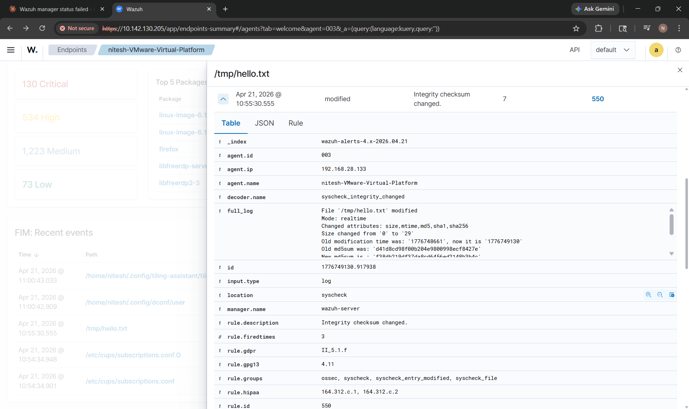
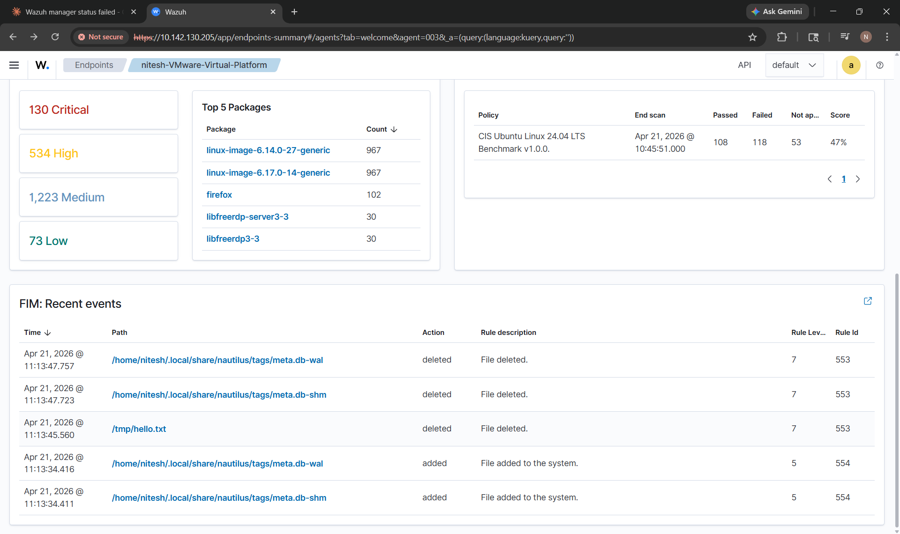

# Wazuh File Integrity Monitoring (FIM) Detection Lab

## Overview

This project demonstrates a hands-on Security Operations Center (SOC) lab using Wazuh to implement **File Integrity Monitoring (FIM)** for detecting unauthorized file activity.

The lab monitors file:

- Creation
- Modification
- Deletion
- Integrity changes
- Configuration tampering

This project simulates real-world blue team monitoring and detection engineering workflows.

---

## Lab Architecture

```text
                +----------------------+
                |   Wazuh Dashboard     |
                | Alert Visualization   |
                +----------+-----------+
                           |
                           |
                +----------v-----------+
                |   Wazuh Manager       |
                | Detection & Analysis  |
                +----------+-----------+
                           |
                     Agent Communication
                           |
                +----------v-----------+
                | Ubuntu Endpoint      |
                | Wazuh Agent + FIM    |
                +----------------------+
```

---

## Technologies Used

- Wazuh SIEM
- Wazuh Agent
- Ubuntu Linux
- File Integrity Monitoring (Syscheck)
- Linux CLI
- Security Event Monitoring

---

## FIM Configuration

Updated Wazuh Agent configuration:

```xml
<syscheck>
  <directories check_all="yes" realtime="yes">/tmp</directories>
</syscheck>
```

### Configuration Explanation

| Parameter | Purpose |
|----------|---------|
| check_all="yes" | Monitor permissions, ownership, hashes, size, timestamps |
| realtime="yes" | Detect changes instantly |
| /tmp | Test directory monitored in this lab |

---

## Agent Restart

```bash
sudo systemctl restart wazuh-agent
```

---

## Attack Simulation

### File Creation

```bash
cd /tmp
touch test.txt
```

---

### File Modification

```bash
echo "changed" >> test.txt
```

---

### File Deletion

```bash
rm test.txt
```

---

## Detection Results

Wazuh generated alerts for:

- File Added
- File Modified
- File Deleted

---

## Sample Detection Rules

| Rule ID | Event |
|--------|-------|
| 553 | File Added |
| 550 | File Modified |
| 554 | File Deleted |

---

## Security Use Cases

This lab helps detect:

- Unauthorized file tampering
- Persistence attempts
- Privilege abuse
- Suspicious system changes
- Early ransomware indicators

---

## MITRE ATT&CK Mapping

| Technique | ID |
|---------|-----|
| File and Directory Discovery | T1083 |
| Modify System Configuration | T1112 |
| Data Encrypted for Impact (simulation relevance) | T1486 |

---

## Screenshots

## Wazuh Dashboard Alerts

### File Creation Detection


---

### File Modification Detection


---

### File Deletion Detection


---

## Incident Response Workflow

1. Detect file change
2. Validate alert
3. Investigate impacted file
4. Determine authorized vs unauthorized activity
5. Restore integrity if necessary
6. Document incident

---

## Project Outcomes

- Built hands-on Wazuh FIM lab
- Configured real-time integrity monitoring
- Simulated attack activity
- Generated and analyzed security alerts
- Practiced SOC investigation workflow

---

## Future Improvements

- Monitor critical files:

```text
/etc/passwd
/etc/shadow
/etc/sudoers
```

- Add Active Response
- Add YARA malware detection
- Integrate VirusTotal
- Expand into multi-lab SOC home lab

---

## Author
Nitesh Vishwakarma

